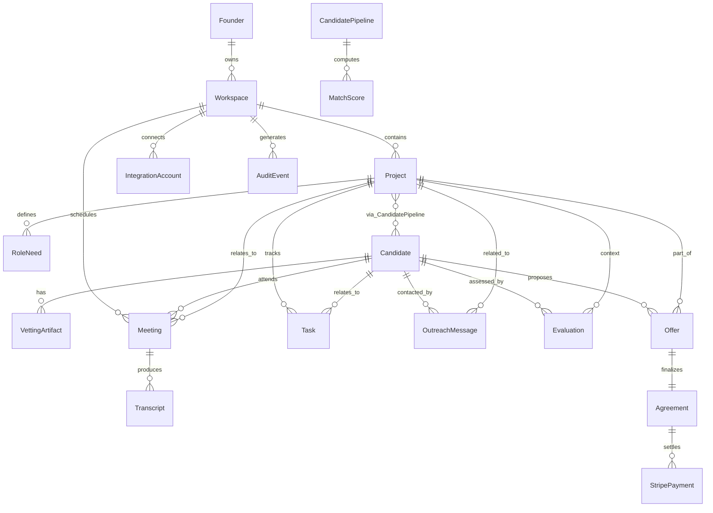

# Data Model for **FoundrMatch.AI** (AI Chief of Staff for Cofounder Matching

## 1) Core Entities & Relationships (High-Level)

* **Founder** `1⟶*` **Workspace**
* **Workspace** `1⟶*` **Project**
* **Project** `1⟶*` **RoleNeed** (e.g., “Full-stack TS”, “ML Ops”)
* **Candidate** `*⟷*` **Project** via **CandidatePipeline** (stage/state)
* **Candidate** `1⟶*` **VettingArtifact** (GitHub snapshot, portfolio, refs)
* **Meeting** ties Founder/Workspace + Candidate + Project + Integrations (Zoom, Otter/Firefly)
* **Transcript** attaches to Meeting
* **MatchScore** computed per Candidate×Project (multi-factor)
* **Task** (Monday.com item) references Project/Candidate/Meeting
* **OutreachMessage** to Candidate (email/Discord/Slack)
* **Evaluation** (structured interview feedback)
* **Offer** (equity/cash) → **Agreement** (signed) → optional **StripePayment**
* **IntegrationAccount** (Zoom, Outlook, Monday, GitHub, Discord, Slack, Loom, Otter, Firefly, Stripe, Granola)
* **AuditEvent** (privacy & forensics)
* **Secret**/**KeyMaterial** (ZeroDB envelope metadata; never plain content)

---

## 2) ER Diagram (Mermaid)



---

## 3) Logical Schemas (Fields, Types, Constraints)

> Types: `uuid`, `text`, `int`, `float`, `bool`, `timestamp`, `date`, `jsonb`, `enum`, `string[]`.
> `PII` marks sensitive fields. All **content** is encrypted-at-rest in **ZeroDB**; only minimal routing metadata remains indexable.

### 3.1 Founder

* `id: uuid (pk)`
* `email: text(PII, unique, indexed)`
* `display_name: text(PII)`
* `company_name: text`
* `timezone: text`
* `created_at: timestamp`
* `zero_profile_ref: text` (pointer to ZeroDB encrypted doc)

### 3.2 Workspace

* `id: uuid (pk)`
* `founder_id: uuid (fk Founder.id, indexed)`
* `name: text`
* `members: jsonb` (additional teammates, roles)
* `created_at: timestamp`
* `encryption_context_id: uuid` (ZeroDB key ref)

### 3.3 Project

* `id: uuid (pk)`
* `workspace_id: uuid (fk Workspace.id, indexed)`
* `title: text`
* `summary_ref: text` (ZeroDB doc pointer; avoids plaintext idea/IP)
* `status: enum('draft','active','paused','archived') default 'active'`
* `created_at: timestamp`

### 3.4 RoleNeed

* `id: uuid (pk)`
* `project_id: uuid (fk Project.id, indexed)`
* `title: text` (e.g., “Founding Full-Stack Engineer”)
* `skills: string[]` (e.g., ["Next.js","Postgres","LLM Ops"])
* `seniority: enum('junior','mid','senior','principal','founding')`
* `commitment: enum('part_time','full_time','contract','cofounder')`
* `location_mode: enum('remote','hybrid','onsite')`
* `notes_ref: text` (ZeroDB pointer)

### 3.5 Candidate

* `id: uuid (pk)`
* `canonical_contact: jsonb(PII)` {name, email, links[]}
* `handles: jsonb` {github, discord, slack, linkedin_url}
* `availability: enum('available','open_to_talk','busy','unavailable')`
* `location: text(PII, optional)`
* `created_at: timestamp`
* `profile_ref: text` (ZeroDB candidate dossier)

### 3.6 CandidatePipeline

* `id: uuid (pk)`
* `candidate_id: uuid (fk Candidate.id, indexed)`
* `project_id: uuid (fk Project.id, indexed)`
* `stage: enum('sourced','contacted','screening','interview','trial','offer','accepted','rejected','withdrawn') indexed`
* `stage_reason: text`
* `priority: enum('low','med','high')`
* `last_activity_at: timestamp (indexed)`
* `owner_user_id: uuid (founder or teammate)`
* `kanban_meta: jsonb` (for Monday.com sync)
* `private_notes_ref: text` (ZeroDB)

### 3.7 VettingArtifact

* `id: uuid (pk)`
* `candidate_id: uuid (fk Candidate.id, indexed)`
* `type: enum('github_profile','repo_snapshot','stackoverflow','portfolio','reference','coding_challenge','resume')`
* `source_uri: text`
* `snapshot_ref: text` (ZeroDB; signed snapshot hash)
* `score_hint: float` (optional pre-score for ML)
* `created_at: timestamp`

### 3.8 MatchScore

* `id: uuid (pk)`
* `candidate_id: uuid (fk Candidate.id, indexed)`
* `project_id: uuid (fk Project.id, indexed)`
* `composite_score: float (0..100, indexed)`
* `weights: jsonb` {skills:0.4,values:0.3,comm:0.2,availability:0.1}
* `subscores: jsonb` {skills, values, communication, availability}
* `explanation_ref: text` (ZeroDB; SHAP-like narrative)
* `computed_at: timestamp (indexed)`

### 3.9 Meeting

* `id: uuid (pk)`
* `workspace_id: uuid (fk Workspace.id, indexed)`
* `project_id: uuid (fk Project.id)`
* `candidate_id: uuid (fk Candidate.id)`
* `scheduled_start: timestamp`
* `scheduled_end: timestamp`
* `platform: enum('zoom','google_meet','discord','slack_huddle')`
* `join_link_ref: text` (ZeroDB; we store tokens securely)
* `recording_asset_ref: text` (ZeroDB pointer; Loom/Zoom)
* `created_by_user_id: uuid`
* `status: enum('scheduled','completed','cancelled','no_show') indexed`

### 3.10 Transcript

* `id: uuid (pk)`
* `meeting_id: uuid (fk Meeting.id, unique, indexed)`
* `provider: enum('otter','firefly','granola','zoom_native')`
* `transcript_ref: text` (ZeroDB; full text)
* `summary_ref: text` (ZeroDB; meeting summary)
* `sentiment: jsonb` {overall, speaker_segments[]}
* `action_items: jsonb[]` (also mirrored to Task)
* `created_at: timestamp`

### 3.11 Task

* `id: uuid (pk)`
* `workspace_id: uuid (fk Workspace.id, indexed)`
* `project_id: uuid (fk Project.id)`
* `candidate_id: uuid (fk Candidate.id, nullable)`
* `title: text`
* `status: enum('todo','in_progress','blocked','done')`
* `due_date: date`
* `monday_item_id: text (nullable)`
* `notes_ref: text` (ZeroDB)
* `created_at: timestamp`
* `updated_at: timestamp`

### 3.12 OutreachMessage

* `id: uuid (pk)`
* `workspace_id: uuid (fk Workspace.id)`
* `project_id: uuid (fk Project.id)`
* `candidate_id: uuid (fk Candidate.id, indexed)`
* `channel: enum('email','discord','slack','linkedin','sms')`
* `direction: enum('outbound','inbound')`
* `subject: text`
* `body_ref: text` (ZeroDB; templates + personalization)
* `sent_at: timestamp`
* `delivery_status: enum('queued','sent','delivered','bounced','replied') indexed`
* `thread_key: text (for conversation stitching)`

### 3.13 Evaluation

* `id: uuid (pk)`
* `project_id: uuid (fk Project.id, indexed)`
* `candidate_id: uuid (fk Candidate.id, indexed)`
* `evaluator_user_id: uuid (founder/peer)`
* `rubric: jsonb` (criteria & weights)
* `scores: jsonb` (per-criterion)
* `overall_score: float (0..10)`
* `notes_ref: text` (ZeroDB)
* `created_at: timestamp`

### 3.14 Offer

* `id: uuid (pk)`
* `project_id: uuid (fk Project.id, indexed)`
* `candidate_id: uuid (fk Candidate.id, indexed)`
* `type: enum('cofounder_equity','employment','contract')`
* `equity_pct: float (nullable)`
* `cash_comp_monthly: int (nullable)`
* `vesting: jsonb` {schedule, cliff, acceleration}
* `doc_ref: text` (ZeroDB; draft)
* `status: enum('draft','sent','negotiating','accepted','declined','expired') indexed`
* `created_at: timestamp`

### 3.15 Agreement

* `id: uuid (pk)`
* `offer_id: uuid (fk Offer.id, unique, indexed)`
* `signed_at: timestamp`
* `signed_doc_ref: text` (ZeroDB; final PDF)
* `effective_date: date`
* `stripe_customer_id: text (nullable)`
* `stripe_subscription_id: text (nullable)`

### 3.16 StripePayment

* `id: uuid (pk)`
* `agreement_id: uuid (fk Agreement.id, indexed)`
* `stripe_payment_intent_id: text`
* `amount_cents: int`
* `currency: text`
* `status: enum('requires_action','succeeded','failed','refunded') indexed`
* `receipt_url_ref: text` (ZeroDB)
* `created_at: timestamp`

### 3.17 IntegrationAccount

* `id: uuid (pk)`
* `workspace_id: uuid (fk Workspace.id, indexed)`
* `provider: enum('zoom','outlook','google_calendar','monday','github','discord','slack','loom','otter','firefly','stripe','granola')`
* `scopes: string[]`
* `auth_metadata_ref: text` (ZeroDB; token envelope)
* `status: enum('connected','revoked','error')`
* `updated_at: timestamp`

### 3.18 AuditEvent

* `id: uuid (pk)`
* `workspace_id: uuid (fk Workspace.id, indexed)`
* `actor_user_id: uuid (nullable for system)`
* `action: text` (e.g., `candidate.update.stage`)
* `entity: enum('candidate','project','meeting','transcript','offer','agreement','integration','task')`
* `entity_id: uuid`
* `meta: jsonb` (non-PII details only)
* `created_at: timestamp (indexed)`

### 3.19 Secret / KeyMaterial (ZeroDB Envelope Metadata)

* `id: uuid (pk)`
* `workspace_id: uuid (fk Workspace.id, indexed)`
* `purpose: enum('db-master-key','integration-token-wrapping','transient-session-key')`
* `kms_metadata: jsonb` (wrapping key id, version)
* `rotation_epoch: int`
* `created_at: timestamp`

---

## 4) ZeroDB Physical Modeling Notes

* **Everything content-bearing is a document** stored encrypted:

  * `*_ref` fields are **opaque pointers** to ZeroDB docs.
  * Example doc types: `candidate_profile.v1`, `meeting_transcript.v1`, `offer_draft.v1`.
* **Envelope structure (example)**:

  ```json
  {
    "doctype": "candidate_profile.v1",
    "nonce": "base64...",
    "ciphertext": "base64...",
    "tag": "base64...",
    "content_hash": "sha256:...",
    "created_at": "2025-10-30T17:00:00Z",
    "owner_workspace_id": "uuid",
    "key_id": "kms://.../wrapping-key/versions/7"
  }
  ```
* **Indexing strategy**: keep indexable, low-risk metadata in relational rows (e.g., stage, status, timestamps, scores). Avoid placing PII or creative IP in plaintext columns.
* **Key rotation**: `Secret/KeyMaterial.rotation_epoch` to drive re-encryption migration.
* **Access control**: decryption keys issued per **Workspace membership**; MPC/MCP agents operate under scoped capability tokens (no plaintext exposure to shared services).

---

## 5) State Machines (Key Workflows)

### CandidatePipeline.stage

`'sourced' → 'contacted' → 'screening' → 'interview' → 'trial' → 'offer' → ('accepted' | 'rejected' | 'withdrawn')`

Guards:

* Move to `interview` requires ≥1 **Meeting** scheduled.
* Move to `offer` requires **Evaluation.overall_score ≥ threshold**.
* `accepted` auto-creates **Agreement** stub.

### Offer.status

`'draft' → 'sent' → 'negotiating' → ('accepted' | 'declined' | 'expired')`

* On `accepted`: create **Agreement**, optionally create **StripePayment** (if cash comp/retainer).

### Meeting.status

`'scheduled' → ('completed' | 'cancelled' | 'no_show')`

* On `completed`: ingest **Transcript**, extract **action_items → Task[]**.

---

## 6) Computation Artifacts

### 6.1 MatchScore Calculation Inputs

* `VettingArtifact.score_hint`
* NLP similarity between **RoleNeed.skills** and Candidate signals
* **Transcript.sentiment** & **communication dynamics**
* **Responsiveness**: `OutreachMessage` timestamps (reply SLA)
* Weight vector stored in `MatchScore.weights`.

### 6.2 Evaluation Rubric (example)

```json
{
  "coding_depth": 0.25,
  "architecture": 0.20,
  "product_thinking": 0.20,
  "communication": 0.20,
  "reliability": 0.15
}
```

---

## 7) MCP Events (Agent Orchestration Payloads)

### 7.1 Event: SOURCE_CANDIDATES.request

```json
{
  "workspace_id": "uuid",
  "project_id": "uuid",
  "role_need_id": "uuid",
  "criteria": {
    "skills": ["nextjs","python","zero-knowledge","llmops"],
    "location_mode": "remote",
    "seniority": "founding"
  },
  "limits": {"max_candidates": 50}
}
```

### 7.2 Event: COMPUTE_MATCH_SCORES.request

```json
{
  "project_id": "uuid",
  "candidate_ids": ["uuid","uuid"],
  "weight_overrides": {"skills": 0.5, "values": 0.25}
}
```

### 7.3 Event: SCHEDULE_MEETING.request

```json
{
  "workspace_id": "uuid",
  "project_id": "uuid",
  "candidate_id": "uuid",
  "platform": "zoom",
  "proposed_slots": ["2025-11-03T15:00:00Z","2025-11-04T17:00:00Z"]
}
```

### 7.4 Event: INGEST_TRANSCRIPT.request

```json
{
  "meeting_id": "uuid",
  "provider": "otter",
  "asset_uri": "provider://otter/transcripts/abc",
  "store_ref": "zero://doc/..."
}
```

---

## 8) Privacy, PII & Audit Boundaries

* **PII in relational columns is minimum viable** (e.g., email for routing); full profiles live inside ZeroDB documents.
* **AuditEvent.meta** must never contain PII or transcript content; only event codes, ids, timestamps, and redacted keys.
* **IntegrationAccount.auth_metadata_ref** stores provider tokens **only within ZeroDB** envelopes (plus provider-side token scoping/rotation).

---

## 9) Referential Integrity & Indexing

* Foreign keys with `ON DELETE CASCADE` for:

  * `Workspace → Project → RoleNeed`
  * `Project → CandidatePipeline / Meeting / Task / Evaluation / Offer`
* Suggested indices:

  * `CandidatePipeline(project_id, stage, last_activity_at)`
  * `MatchScore(project_id, composite_score desc)`
  * `Meeting(workspace_id, scheduled_start desc)`
  * `OutreachMessage(candidate_id, sent_at desc)`
  * `Evaluation(candidate_id, created_at desc)`
  * `Offer(candidate_id, status)`
  * `AuditEvent(workspace_id, created_at desc)`

---

## 10) Example ZeroDB Documents

### 10.1 `candidate_profile.v1`

```json
{
  "name": "A. Dev",
  "headline": "Founding Full-Stack Engineer (TypeScript/AI)",
  "bio": "Built 3 MVPs... led infra...",
  "contact": {"email":"a.dev@example.com","phone":"+1..."},
  "links": {"github":"...","website":"..."},
  "skills": ["Next.js","Node","Postgres","LLM Ops","Kubernetes"],
  "work_samples": [{"title":"MVP X","url":"..."}],
  "preferences": {"equity_min":0.5,"salary_range":"negotiable","time_zone":"CST"}
}
```

### 10.2 `meeting_transcript.v1`

```json
{
  "meeting_id":"uuid",
  "raw_text":"[full transcript...]",
  "summary":"We aligned on architecture...",
  "speakers":[{"name":"Founder","turns":35},{"name":"Candidate","turns":33}],
  "sentiment":{"overall":0.72,"segments":[...]},
  "action_items":[
    {"title":"Share architecture doc","due":"2025-11-05"},
    {"title":"Trial task definition","due":"2025-11-07"}
  ]
}
```

### 10.3 `offer_draft.v1`

```json
{
  "candidate_id":"uuid",
  "project_id":"uuid",
  "package":{
    "type":"cofounder_equity",
    "equity_pct":1.5,
    "vesting":{"schedule":"4y","cliff":"1y","acceleration":"partial"}
  },
  "notes":"Open to cash component post-MVP"
}
```

---

## 11) Role-Based Access Control (RBAC)

* **Founder (Owner)**: full read/write in Workspace.
* **Teammate**: read; write limited to Projects they own.
* **Agent (MCP)**: **capability-scoped**—can read/write specific records/fields and corresponding ZeroDB docs via time-boxed tokens.
* **Read-only Collaborator**: read only to Project subset (e.g., advisors).

Field-level examples:

* `Candidate.canonical_contact.email` readable by Owner/Teammate; not by external reviewers.
* `IntegrationAccount.auth_metadata_ref` readable only by MCP Agent and Owner; write via secure flow; never exported.

---

## 12) Data Retention & Deletion

* **Soft delete** flags on high-value records (`deleted_at`) plus **hard delete** routines:

  * On candidate deletion by request: purge Candidate, CandidatePipeline rows and all ZeroDB docs (`profile_ref`, transcripts, vetting snapshots).
* **Transcript redaction** option: remove PII/entities while preserving intent (stored as a new doc version).

---

## 13) Minimal Relational DDL (Illustrative)

```sql
-- Example: CandidatePipeline
CREATE TABLE candidate_pipeline (
  id uuid PRIMARY KEY,
  candidate_id uuid NOT NULL REFERENCES candidate(id) ON DELETE CASCADE,
  project_id uuid NOT NULL REFERENCES project(id) ON DELETE CASCADE,
  stage text NOT NULL CHECK (stage IN
    ('sourced','contacted','screening','interview','trial','offer','accepted','rejected','withdrawn')),
  stage_reason text,
  priority text CHECK (priority IN ('low','med','high')) DEFAULT 'med',
  last_activity_at timestamptz NOT NULL DEFAULT now(),
  owner_user_id uuid,
  kanban_meta jsonb,
  private_notes_ref text
);
CREATE INDEX idx_cp_project_stage_activity ON candidate_pipeline(project_id, stage, last_activity_at DESC);

-- Example: MatchScore
CREATE TABLE match_score (
  id uuid PRIMARY KEY,
  candidate_id uuid NOT NULL REFERENCES candidate(id) ON DELETE CASCADE,
  project_id uuid NOT NULL REFERENCES project(id) ON DELETE CASCADE,
  composite_score float NOT NULL,
  weights jsonb NOT NULL,
  subscores jsonb NOT NULL,
  explanation_ref text,
  computed_at timestamptz NOT NULL DEFAULT now()
);
CREATE INDEX idx_ms_project_score ON match_score(project_id, composite_score DESC);
```

---

## 14) What Developers Do Next

1. **Generate typed SDK models** (TS/Go/Python) from these schemas.
2. **Wrap ZeroDB access** with a small DAO that:

   * Resolves `*_ref` → decrypt → returns typed objects
   * Enforces `workspace_id` guardrails and capability tokens
3. **Emit MCP events** for sourcing, scoring, scheduling, and ingestion as defined (Sec. 7).
4. **Mirror minimal metadata** to Monday.com/Stripe as needed; keep content in ZeroDB only.

---

If you want, I can convert this into:

* `DATABASE.md` (dev-friendly reference)
* A **JSON Schema bundle** for each ZeroDB document type
* A **Postman/Bruno collection** with MCP event samples and example API requests.
